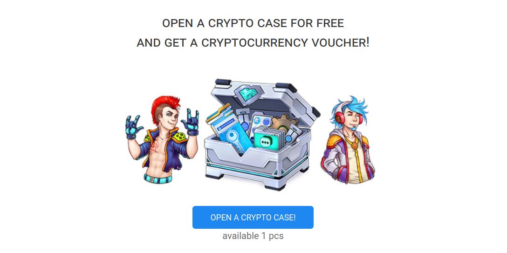

# Utopia Crypton Faucet



An example of creating a crane for distributing Cryptons

## Requirements
* PHP 7.1;
* Apache 2.6;

## Installation

An example for a project called project:

```bash
git clone https://github.com/Sagleft/PHP-blank-MVC.git project
cd project
mkdir view/cache
chmod 777 view/cache
cp .env.example .env
cp composer.json.example composer.json
composer update
cd controller/public_html
cp example.htaccess .htaccess
mkdir css/external
mkdir js/external
cd ../../tools
sh get_depends.sh
```

* Import table dump from `vouchers.sql`.
* Next, **make changes to `.env`**
* `public_html` directory: ``` controller\public_html ```.

## How to import vouchers

place voucher codes to `tools/vouchers.csv`,

open dir `tools`, execute

```php
php import_vouchers.php
```

done!

## Copyright

Copyright (c) 2024 Sagleft.


---

[](https://udocs.gitbook.io/utopia-api/)


